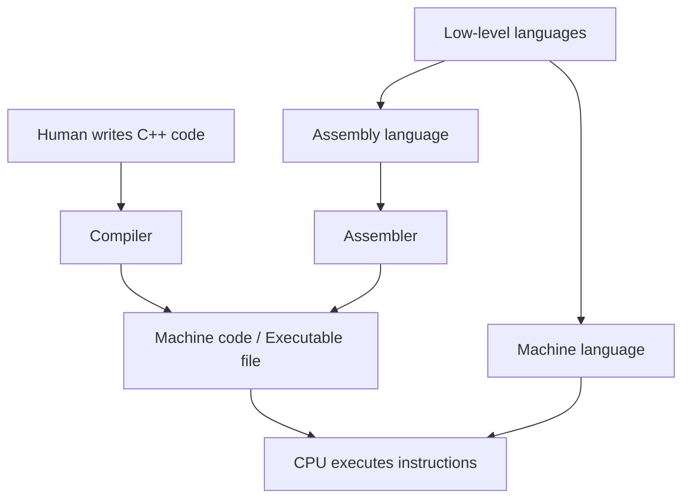
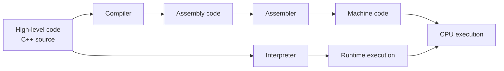
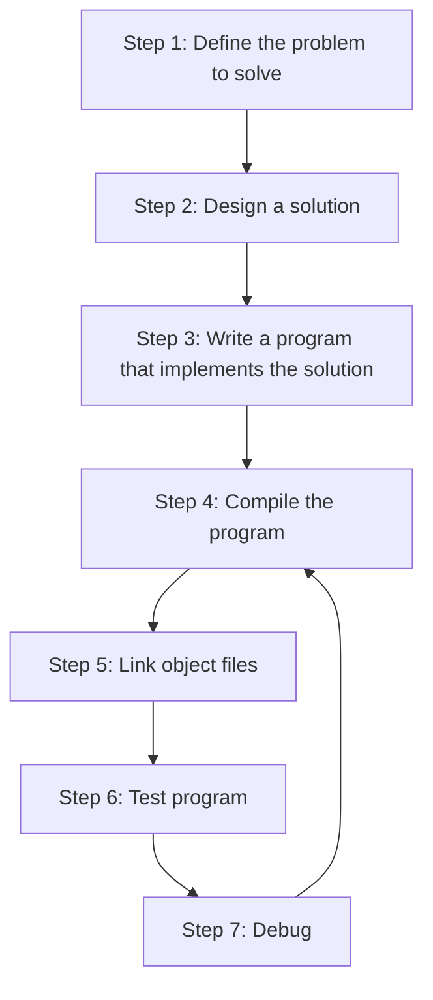

# Cpp In Flow STATE


**Machine Language** - A computer's CPI is incapable of understanfing normal programming language for that we use machine code.

**bits** - a 1 or a 0 indicates a bit back in the days cs people wirte these directly which was time consuiming from this we got the cpu family convention about 32 bit and 64 bits etc etc which basically means that when a computer's cpu can take any instruction you have to sum up your instruction in 32 binary numbers at a time if your computer has 32 bit cpu and 64 binary nums indicating your instruction for 64bit cpu.

- that's why 32 bit cpu is slow for modern games

> also each cpu family of compatible CPUs has its own machine language, and this machine language is not compatible with the machine language of other CPU families. that's why you see directx like programs for windows which is mainly x86 and not for modern mac because they are arm64

- if you are someone who is very curious then [here](https://en.wikipedia.org/wiki/Comparison_of_instruction_set_architectures#Instruction_sets) are Different CPU families for you.

## (101010010101) this Shit is Hard and no person without any substance can write this. That's why we made **Assembly language**

- human redable machine language (understandable also).
- the operattion (what the isntruction does) is identified be a short memonic(typically a 3-4 letter name).`mov` is easily understood to me a mnemonic for "move", which is an operation that copies bits from onw loCATION TO ANOTHER.
- Registers(Fast memory locations that are part of the CPU itself) are accessed by a name. `al` is the name of a specific register on an x86 CPU.
- Numbers can be specified in a more convenient format. Assembly languages typically support both decimal numbers(e.g. 97) and hexadecimal numbers (e.g. 0x61).

*is is fairly easy to understand that the assembly instruction `mov al,0x61` copies hex number 0x61 into `al` CPU register.*

### Not So Fun Fact
- there are many assembly languages. although conceptually similar, different assembly lang support diff. instructions, use diff. naming conventions because different CPU family understand different machine code and the **assembler** which translate the code into machine language cant creates a universal manile language for all CPU.

## Intro to low level languages.

machine lang and assembly both are low level because the program provides minimal abstraction form the architecture of the machine 

- abstration meaning being nonchalant about complex, unnecesary detasils and focusing on the essential features of something 

in other words these languages are the base languagess that cpu hardware can understand and when you write them you can also understand what the cpu willget as instruction 

*In the most simplest terms these languages can give you the power to write code directly to the hardware*

## there are many grate things about low level langs but we are not here to study this so we will study the cons of these languages
1. portablity - since low level language is tailored to specific instruction set architecture, the programs written in the language are too.
2. Learning curve - writing these languages require you to have very deep architectural knowledge about the hardware on which you are writing code.
3. hard to understand - you are not able to understand linux kernal codbase till now you want to understand low level language codebases
4. as complexity of the task increases your ablity to write and commit good low level code decreases

## Intor to what we have came for high level languages

Much like assembly which must be assembled to machine language, Programs writen in a high level language must be translated into machine languate before they can be run.

Promary ways to do this is use **compiler and interpreter**
- C++ has a compiler which is a program (collection of it) that reads the source code of one language (usually a high level language) and translated it into another languate (a low level language) 
- C++ compilers can also be configured to generate assembly code. because sometimes a programmer wants to see what specific instruction the compiler is generating for a section of the program.


Machine code output by the compiler is packed into an executable file (containing machine language instructions) *can be distirbuted to other machine by the OS*


*once compiler produces the output you can delete the compiler all together because you already have the instructions*

### Alternatively we also have an **interepeter**
-  Directly executes the source code without requiring them to be compiled first.
- tends to be more flexible then compilers
- less efficient when running program because the interpreting process needs to be done every time the program is run 
- intrepreter must be isntalled on every machine were an intrepeted program will be run.

### Language Translation Flow


> # Optional Reading for people like me
> A Good comparision of the advantages of compilers vs interpreters can be found [here.](https://stackoverflow.com/questions/38491212/difference-between-compiled-and-interpreted-languages/38491646#38491646)
> Another Advantege of compiled programs is that distributing a compiled program does not require distributing the source code. In a non-Open-Source environment, this is important for intellectual property(IP) protection purposes.

## INTRODUCTION TO C/C++
just google the history of C okay!!

also for c++...

- The underlying philosophy of C and C++ cna be summed up as a "Trust the programmer" -- which is both wonderfull and dangerous. C++ is desgined to allow the programmer a high degree of freedom to do what they want. However, this also means the languate often won't stop you from doing things that don't make sense, because it will assume you're doing so for some reason it doenst understand.There are quite a few pitfalls that new programmers are likely to fall into if caught unaware. This is one of the primary reasoin why knowing what you shouldnt do in C/C++ is almost as important as knowing what you should do.

## The intresting Development part starts now.....
 Here is a graphic outlining a simplistic approach of how CPP programms get developed.



### Step 1: Define the problem
### Step 2: Deterrmina how you are going to solve the problem
There are 2 type of solution a good solution and a bad solution if after setp 1 you directly write a peace of code with the first solution you got in your mind then most probably it will faslls into the bad category

**Typically, good solution have the following characteristics:**
- they are straightforward(not overly complicated or confusing)
- they are well documented(especially around any assumptions being made or limitations).
- They are built modularly, so parts can be reused or changed later withour impacting other parts of the program.
- they can revcover gracefully or give usefull error messages when something unexpected happens.

*When you sit down and start coding right away, you're typically thinking "I want to do <something>", so you implement the solution that gets you towards the solution the fastest. This can lead to programs that are fragile, hard to change or extend later, or have lots of bugs.*

in modern time most of the time of a programmer is spent on debugging, updating the socpe or a pirticular module in  the code and the actually building time is been reduces by AI which is only 5 to 10 % of the overall lifecycle of the project. I am changing my self to spend a little extra time up front (before I start coding) thinking about the best way to tackle a problem, WHat assumptions you are making, and how you might plan for future, in order to save yourself a lot of time and trouble doen the road.

*if you are new to programmin and CS in all then please dont follow my above adive and just start coding this will teach you how to code*

### Setp 3: Write the Program.
dont have much to say on this we will learn this part **that's why we are here ig.**

### Step 4: Compiling your source Code
to compile C++ we require C++ compiler (Yeah!!.. No shit sherlock)
then the compiler goes to each .cpp file you create 

- First, the compiler checks your C++ code to make sure it follows the rules of the C++ language. If it does not, the compiler will give you an error( and the corresponding line number) to help pinpoint what needs fixing. The Compilation process will also be aborted until the errors is fixed.

- then the compiler translates your C++ code into mahcine language instructions. These instructions are stored in an intermediate file called an **object file**, The object file also containd other data that is required or useful in subsequent steps(Including data needed by the linker in the step 5, and for debugging in the step 7)

- object files are named as `name.o` or `name.obj`, where name is the same name as the .cpp file it was produced from.

```
Source file:        Source file:        Source file:
Calculator.cpp       Fraction.cpp          Math.cpp
     |                    |                    |
   Compile              Compile              Compile
     |                    |                    |
     v                    v                    v
Object file:        Object file:        Object file:
Calculator.o          Fraction.o           Math.o
```

### Step 5: Linking object files and libraries and creatign the desired output file

Here comes the Linker part, After the compiler has successfully finished, another program called the **linker** kicks in. 
- The linker's job is to combine all of the object files and produce the desired output file(such as an executable file that you can run). This process is call **linking**
- if any step in the linking process fails, the linker will generate an error message describe the issue and then abort.
1. the linker make sure that object file generated by the compiler are valid.
2. the linker ensures all cross-files dependencies are resolved properly. For example, if you define something in one .cpp file, and then use it in a different .cpp file, the linker connects the tow together. if the linker is unsable to connect a reference to something with its definition, you'll get a linker error, and the linking process will abort.
3. the linker typically links in one or more **library files**, which are collection of precompiled code that have been "packeged up" for reuse in other programs.
4. the linker output the desired output file. Typically this will be an executable file that can be launched(but it could be a library file if tha't how you've set up your project)

```
 Object file:        Object file:        Object file:
 Calculator.o          Fraction.o            Math.o
      \                    |                    /
       \                   |                   /
        v                  v                  v
C++ Standard   -->      Linker       <--   Other Libraries
   Library                |
                          v
                  Executable file:
                   Calculator.exe
```
#### The Standard library
`# include <iostream>`
this line right here represent a very importand Input/Output library which contains functionality for printing text on a monitor and getting keyboard input from a user.
*this library and many more libraries comes under C++ standard library*
- Almost all C++ program written utilize the standard library in some way
*linkers are configured to link this by default, so chill*
##### 3rd party libraries
libraries created by people like you independently which doesnt come under the standard library.
##### Building
Because there are multiple steps involved, the term **building** is often used to refer to the full process of converting source code files into an executable that can be run. A specific executable produced as the results of building is sometimes called a **build**.


### Step 6 & 7 :  Testing and Debugging
Now this is the fun Part!!! 
you are now able to run your executable and see what it does!

*Basic testiong typically involves trying different inpur combinations to ensure the software behaves correctly in different cases.*

*if the program does not behaves as expected, then you will have to do some **debugging**, which is the process of finding and fixing programming errors.*

#### For IDEs just watch a youtube video bro

<moving on>

## Console Project
When we create a new project, we'll gen lly be asking ourselves which type of project we want to create. All the projects that we will create will be console projects

- A console project means that we are going to create programs that can run on win, linux, mac console

<not gonna tell you what to do to create a folder or the file jsut 
figure out yourself>

create a file name main.cpp for now and start coding this 
```cpp
#include <iostream>
int main()
{
    std::cout << "Hello,world!";
    return 0; 
}
```
To compile main.cpp and run the program, make sure main.cpp is open, then wither chose Run > Run Without Debugging from the top nav, or click the play icond to the right of main.coo tab and choose Run c/c++ File. 

<if yoy are using G++ on trhe command line then use the commang `g++ -o main main.cpp` then this will compile and link main.cpp, To run it just type: main or possibly ./main and you will see the output of your program.>

##### If your programs runs and the console windows flashes and closes immediately 
Then it means that the program has finished running, most modern IDEs will keep the console open so you cna inspect the result of the program before continuing. However, come older ides will cutomatically close the console window when the program finished running. This is generally not what you what.

If your IDE closes the console window automatically, the following two steps can be used to ensure the console pauses at end of the profram.

First, add or ensure the following lines are near the top of your program:

```cpp
#include <iostream>
#include <limits>
```

Second, add the following code at the end of the main() function (just before the return statement):

```cpp
std::cin.clear(); //rest any errors flags
std::cin.ignore(std::numeric_limits<std::streamsize>::max(),'\n'); //ignore any characters in the input buffer until we find a newline
std::cin.get(); // get one more char from the user(waits for user to press enter)
```

This will cause your program to wait for the user to press enter before contiuning(you many have to press enter twice), which will give you time to examine your program's output before your IDE closes the console window.

Other solutions, such as the commonly suggested `system("pause")` solution may only work on certain operating system and should be avoided.

##### What is the difference between the compile, build, rebuild, clean, and run/start options in my IDE?

- **Build** compiles all modified code files in the project or workspace/solution, and then links the object files into an executable. If no code files have been modified since the last build, this option does nothing.
- **Clean** removes all cached obj and exe to the next time the project is built, all files will be recompiled and a new executable produced.
- **Rebuild** does a "clean", followed by a "build".
- **Compile** recompiles a single code file (regardless of whether it has been cached previoudly). This option does not invoke the linker or produces an exe.
-**Run/Start** executes the .exe from a prior build. Some IDEs (e.g. Visual Studio) will invoke a "Build" before doing a "run" to ensure you are running the latest version of your code. Otherwise( e.g. Code::Blocks) will just ececute the prior executable

### Congratulations you have made it through the hard part.

## Configuring your compiler: Build configurations

A build configuration (also called a build target) is a collection of project settigns that determines how your IDE will build your project. This includes things like ehat the executable will be named, what directoriesd the IDE will look in for other code and library files, whether to keep or strip out debugging information, how much to have the compiler optimize your program, etc... Generally, you will want to leave these setting as it is unless you have a specific reason to change something

When you create a new project your IDE, most IDEs will set up 2 different build configurations for you: A release configuration, and  a debug ocnfigurations.

- The **Debug Configuration** is designed to help you debug your program
    1. generally the one you will use when writing your programs.
    2. This turns off all optimizations, and includes debugging info
    3. Makes your program larger and slower, *but much easier to debug*.
    4. It is selected as the active configurations be default. 

- The **Release Configuration** is desfined to be used when releasing your program to the public.
    1. This version is typically optimized for the size and performance.
    2. This doesn't contain the extra debugging information.
    3. the release configuration includes all opimizations.
    4. this mode is also useful for testing the performance of your code


>**Best practice** - use the debug build conf when developing your programs. when you are ready to release your executable to others, or what to test performance use the release build conf.


### Switching b/w build configurations
> #### For Visual Studio users 
> There are multiple ways to switch b/w debug and release in visual studio. The easiest way is to set your selection directory from solution configuration drodown in the Standard Toolbar Options:
> you can also access the conf manager dialog by selecting Build menu > Configuration Manager, and change the active solution configuration.
>To the right of the Solutions Configurations dropdown, Visual Studio also has a Solution Platform dropdown that allows you to switch between x86(32-bit) and x64(64-bit)platforms.

> #### For Code::Blocks users
> you should see an item called Build Target in the compiler toolbar --> set it to Debug for now.

> #### For gcc and Clang users
>Add `-ggdb` to the command line for debug builds and ` -02 -DNDEBUG ` for release builds. Use the debug build option for now.
> For GCC and Clang, The `-O#` option is used to controle optimization settings. the most common options are as follows:
> - `-O0` is the recommended optimization level for debug builds, as it disables optimization. This is default setting.
> - `-O2` is the recommended optimization level for release builds, as it applies optimizations that should be beneficial for all programs.
> - `-O3` adds additional optimizations that may or may not perform better then `-O2` depending on the specific program. Once your program is written, you can try compiling your release build with `-O3` instead of `-O2` and measure to see which is faster.

> #### For VC Code users
> When you first ran your program, a new file called task.json was created under the .vscode folder folder in the explorer plane. Open the task.json file, find "args", and then locate the line "${file}" within that section.
>Above the “${file}” line, add a new line containing the following command (one per line) when debugging:
>`-ggdb`,
>Above the “${file}” line, add new lines containing the following commands (one per line) for release builds:
`-O2`,
`-DNDEBUG`,

### Configuring your compiler: compiler extensions
Okay so all cpp programs behave in a specific manner given a specific circumstance, But many compilers implement their own changes to the language, often to enhance compatibility with other versions of the language(e.g. C99), or for historical reason. These behaviours are called **compiler extensions**

Writing a program that makes use of a compiler extension allows you to write programs that are incompatible with the C++ standard. Programs using non-standard extensions generally will not compile on other compilers (that don’t support those same extensions), or if they do, they may not run correctly.

Frustratingly, compiler extensions are often enabled by default. This is particularly damaging for new learners, who may think some behavior that works is part of official C++ standard, when in fact their compiler is simply over-permissive.

Because compiler extensions are never necessary, and cause your programs to be non-compliant with C++ standards, we recommend turning compiler extensions off.

> #### Best Practice
> Disable compiler extensions to ensure your programs(and coding proactices) remain compliant with C++ standards and will work on any system.


>### Disabling compiler extensions

>#### For Visual studio users
> To disable compiler extensions, right click on your project name in the Solution Explorer window, then choose properties:
> - From the project dialog, first make sure the Configuratiosn field is set to All Configurations.
> Then, click C/C++ > Language tab and set Conformance mode to yes(/permissive-)(if it is not already set to that by default).

> #### For Code::Blocks users
> Disable compiler extensions via Settings menu > compiler > Compiler flags tab, then find and check the -pedantic-errors option.

> #### For gcc and Clang users
> you can disabel compiler extensions by addding the -pedantic-errors flag to the compiler command line.

> #### For VS Code users
> - Open the task.json file, find `"args"`, and then locate the line `"${file}"` within that section
> - Above the `"${file}"` line, add a new line containing the following commands:
> - `"-pedantic-errors"`

> This flag is supported by GCC and Clang and enables stricter enforcement of the ISO C++ standard by treating required standards-conformance diagnostics as errors.
>VS Code does not insert a final newline at the end of a file by default in many configurations, but it provides a built-in setting to do so automatically. Enabling this setting helps ensure your source files end with a newline, which is recommended for standards conformance and compatibility with many development tools.
> - Open File (or Code on macOS) → Preferences → Settings.
> - Search for Insert Final Newline.
> -Enable Files: Insert Final Newline. Enabling it in User Settings is usually sufficient; use Workspace Settings only if you want this behavior to apply specifically to the current project.

### Configuring your compiler: Warning and errors levels
In most cases, When the compiler encounters some kind of issue, it will emit **diagnostic message** (often called **diagonstic** for short). The C++ standard does not define how diagnostic messages should be categorized, worded, or how thoes issues should affect the compilation of the program. However, Modern compilers have conventionally adopted the following:

- A **Diagnostic error**(**error** for short) means the compiler has decided to halt compilation, because it either cannot proceed or deems the error serious enough to stop. Diagonstic errors generated by the compiler often called **compilation errors, compiler error or compile errors**
- A **Diagnostic warning**(**warning** for short) means the compiler has decided not to halt compilation. in such cases, the issue is simply ignored, and compilation preceeds.

> #### Key insight
>Compilers determine whether a non-blocking issue is a warning or an error. Which they usually align in their categorization, in some cases, compilers may not agree with one compiler emitting an error and another compiler emitting a for the same issue.

Diagnostic messages typically contain both the filename and line number where the compiler found the issue, ans some text about what what expected vs what was found. The actual usse may be on that line, or on a preceding line. Once you've addressed the issue causing the diagnostic, you can try compiling again to see if the associated diagnostic message is no longer generated.

> #### Best Practive
>Don't let warnings pile up. Resolve them as you encounter them(as if they were errors). Otherwise a warening about a serious issue may be lost among warning about non-serious issues.

The linker may also generated diagonostic errors if there are an issue that occurs when linking that connot be resolved


### Increasing your warnning levels 
By default, most compilers will only generate warnings wbout the most obvious issues. However, you can request your compiler be more assterive about providing warnings,and it is generally a good idea to do so.

> #### Best practice
> Turn your warrning levels up, especially while youe are learning. The diagonstic information my help in identifying programming mistakes that can cause your programming to malfunction 

> #### For Visual Stucrio users
> To increase your warning leevels, right click on your project name isn the Solution Explorer Windoe, then, Choose Properties:
> - form the Project Dialog, First make sure the Configuration field is set to All Configurations.
> - Then select C/C== > General tab and set Warning level to level 4(/W4):
>Note: Do not choose EnableAllWarnings(/Wall) or you will be buried in warnings generated by the C++ standard library.
>Visual Studio disable signed/unsigned convorsion warning by default, and those are useful, so if you are using Visual Studio 22019 or newer, let's enable those:
> - From C/C== > COmmandline tab, under additional options, add `/w44365`. this tells the compiler to enable signed/unsigned conversion warnings at warning level 4(which you enable above).
> - Form C/C++ > External Includes tabs, Set External Header wrnings Level to Level3(/external:W3). This tells the compiler to compile standard library headers at warning level 3 ( instead of 4 ) so that compiling those headers doesn't trigger this warning.


>#### For Code::Blocks users
> From Setting menu>Compiler>compiler setting tab, find annd check the option that correlate which -Wall, -Weffc++, and -Wextra:
>- Then go to the Other compiler tab options and add -Wconversion -Wsign-conversion to the following text edit area:
> Note: The -Werror parameter is explaned below.


> #### Fop gcc users
> add the followinf flags to your command line: -Wall -Wefffc++ -Wextra -Wconversion -Wsign-conversion

>#### For VS Code users
> Open the task.json file, find "args", and then locate the line `"${file}"` within that section.
>Above the `"${file}"` line, add new lines containing the following commands(one per line):
```json
"-Wall",
"-Weffc++",
"-Wextra",
"-Wconversion",
"-Wsign-conversion",
```
#### Treeat warnings as errors
ti is also possible to tell your compiler to treat all warnings as if they weere errors(in which case, the compiler will halt copmpilation if it findas any warning). This is a good way to enforce the recommendation that you should fix all warnins(if you lack self-discipline, which most of us do).

> #### Bast Practice
> Enable "Treat warnings as errors". This will force you to resolve all issues causeing warnings.


> ##### For Visual Studio users
> to treat warnings as errors, right click on your project name in the Solution Explorer window, then choose Properties:
> Form the Project dialog, first make sure the Configuration field is se to All Configurations.
> then select C/C++ > General tab and set treat warnings as Errors to Yes(/WX)


> ##### For Code::Blocks users
>From Setting menu > Compiler > Other Compiler Option tab, add -Werror to the text edit area:


> ##### For Gcc users
>Add the following flag to your command line: -Werror

> ##### For VS Code Users
>In the `task.json` file, add the following flags begore `"${file}"`, one per line:
>`"-Werror",`

